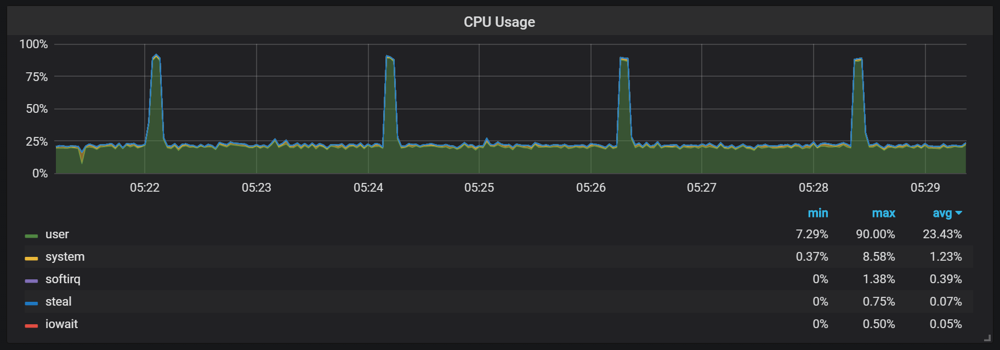

---
title:
- Rust
author:
- Jakob Lambert-Hartmann
date:
- 2025
graphics: true
theme: metropolis
suppress-figure-numbering: true
---

## Introduction

\begin{center}
\includegraphics[height=0.9\textheight]{./images/rewrite-in-rust.png}
\end{center}


## Rust 

- Fast like C/C++
- Package Manager like Python and JS
- Functional Programming like Haskell and JS
- Type system like no other


## Outline 

1. Memory Management
    1. Manual
    2. Garbage Collector
    3. Ownership
2. Error Handling 
    1. In C
    2. In Java
    3. In Rust


# Memory Management

## Memory Management

::: columns

:::: {.column width=45%}
**Stack**

- Fast allocation
- Fixed size
- Manages itself
::::

:::: {.column width=45%}
**Heap**

- Slower allocation
- Dynamic size
- Needs to be managed
::::

:::


## Manual Memory Management

- Programmer responsible for allocating/freeing memory
- Many possibilities of failure: 
    - Memory leak
    - Double Free 
    - Use After Free


```C
// allocate
DataType* data = malloc(sizeof(DataType)); 
// free
free(data); 
```


## Garbage Collector

- language manages memory
- periodically checks for heap data without references


{ height=70% }
source: percona
<!-- https://www.percona.com/blog/prometheus-2-times-series-storage-performance-analyses/ -->


# Rusts Memory Management

## Ownership

- Resource Acquisition is Initialization (RAII)
- Memory manages itself
- Three rules required: 
    1. Each value has an owner
    2. There can only be one owner at a time
    3. When the owner goes out of scope, the value will be dropped

## Ownership: Code Snipped

```rust 
fn main() {
    // s1 owner of "hello"
    let s1 = String::from("hello") 

}   // s1 goes out of scope -> value "hello" dropped
```

## Ownership: Memory Representation


::: columns
:::: {.column width=45%}
- **Stack:** len, capacity, and ptr
- **Heap:** String data 
- when `s1` goes out of scope $\rightarrow$ free String data
::::
:::: {.column width=45%}
{height=60%}
source: rustbook
::::
:::


## Ownership: Code snipped, shared data

- What happens when two variables use the same data:
```Rust
{
    let s1 = String::from("hello"); 
    let s2 = s1; 
}
```
- Three options $\rightarrow$

## Ownership: Option 1: Shallow Copy


::: columns
:::: {.column width=45%}
- Stack data copied
- **Only one owner allowed!**
- Double Free when `s1` and `s2` go out of scope
::::
:::: {.column width=45%}
{height=60%}
source: rustbook
::::
:::


## Ownership: Option 2: Deep Copy 

::: columns
:::: {.column width=45%}
- Stack and heap data copied
- **But copying data can be very expensive!**
::::
:::: {.column width=45%}
{height=60%}
source: rustbook
::::
:::

## Ownership: Option 3: Move

::: columns
:::: {.column width=45%}
- `s2` new owner of data
- `s1` is invalidated
- **What Rusts does!**
::::
:::: {.column width=45%}
{height=60%}
source: rustbook
::::
:::


## Ownership: Move

```rust 
let s1 = String::from("hello"); 
let s2 = s1;  

println!("{s1}, world!");
```

- does not compile: **`s1` is not valid anymore**
- `s1` passed ownership over string data to `s2`


## Function Calls: Ownership

```rust
fn compute_length(s: String) -> usize {
    s.len()
}

fn main(){
    let s1 = String::from("hello"); 
    compute_length(s1); // moves value
    compute_length(s1); // s1 now invalid
}
```

- function take ownership of their parameters
- Code does not compile: 
    - first `compute_lenght` takes ownership of `s1`
    - second `compute_lenght` call not possible: `s1` does not own data anymore


## Function Calls: Borrowing

```rust
fn compute_len(s: &String) {
    s.len()
}

fn main(){
    let s1 = String::from("hello"); 
    compute_len(&s1); 
    compute_len(&s1); 
}
```

- functions can return ownership when done with references
- `some_function` returns ownership of `s1` after return


## Borrowing: Memory Layout

::: columns
:::: {.column width=35%}
- multiple references, one owner
- no double free
::::
:::: {.column width=55%}
{height=70%}
source: rustbook
::::
:::


## Lifetimes
Bind lifetimes of two variables together: 
```rust 
fn first_word<'a>(s: &'a str) -> &'a str {
    &s[0..1]
}
```
- references never outlive the value they reference
- **Compiler automatically deduces most lifetimes**

## Mutability

Variables immutable by default: 
```rust 
let immutable   = 1; 
let mut mutable = 1; 
```

References immutable by default: 
```rust
let reference_1 = &variable;
let reference_2 = &variable;
```

**If there exists a mutable reference: only reference allowed!**
```rust 
let immutable_ref = &variable;
let mutable_ref   = &mut variable;
// immutable_ref is now invalid !!!
```


## Security Guarantees

A reference always points to valid data: 
```rust 
let mut string = String::from("hello");
// immutable reference
let substring = string[0..3]; // reference to "he"

// mutable borrow (reference)
string.clear();

// compilation error: mutable borrow in clear()
println!("{substring}, world!");
```


# Error Handling 

## Types Of Error


1. Logical Errors
1. Compile Errors 
1. Runtime Errors
    1. Performing invalid arithmetic: division by zero, etc.
    2. Accessing invalid data: null pointers, out of bounds, etc.
    3. Failing function calls: opening nonexistent file, etc.


## Error Handling In C

\begin{center}
\includegraphics[height=0.9\textheight]{./images/undefined-behavior.jpg}
\end{center}

## C Error Handling: Performing invalid arithmetic
**It doesn't**

```C
int a = 1;
int b = 0;
int c = a / b;
// here be dragons (undefined behaviour)
```

## C Error Handling: Accessing invalid data

**It doesn't**

```C
int[2] arr = [1,2];
int el = arr[2];
// here be dragons (undefined behaviour)
```

## C Error Handling: Calling a function that fails
**It doesn't? Kind of?**

```C
char* path = 'file/does/not/exist';
FILE* f = fopen(path); 
// here be dragons (undefined behaviour)
```

- Return value of function may help detect errors
- Success/Failure values differ from function to function
    - `fopen()` returns `NULL` on failure
    - `system()` returns `0` on success
    - some functions set `errno` some don't


## Error Handling In Java

- Helps developers to handle errors
- Uses exceptions: 
    1. dividing by zero: `ArithmeticException`
    2. access array out of bounds: `ArrayIndexOutOfBoundsException`
    3. opening nonexistent file: `FileNotFoundException`
- Not all exceptions need to be checked at compile time: `NullpointerException`


# Error Handling in Rust

## Panic
```rust 
panic!()
```
- terminate program immediately 
- used in Rusts error handling to prevent undefined behavior


## Option
```rust 
enum Option<T> {
    None, 
    Some(T),
}
```
- can hold value of type `T`
- or nothing


## Result 
```rust 
enum Result<T, E> {
    Ok(T),
    Err(E),
}
```
- provides additional information on failure


## Unpacking Values

```rust 
let vec = vec![0,1,3]; 
let option = vec.get(3); 

// only executed when there is a value
if let Some(value) = option {
    println!("vec[3] == {value}");
}

// only executed when there is no value
if let None = option {
    println!("array out of bounds");
}
```


## Helper Functions
```rust 
let result = fs::read_to_string("not a file"); 

// exit program and print information
let content = result.expect("could not read file"); 

// exit program without message
let content = result.unwrap(); 

// use default value if error occured
let content = result.unwrap_or("default content"); 

```


## Error Propagation
`?` operator propagates error or continues with unwrapped value:
```rust 
fn count_words(path: &str) -> Result<usize> { 
    // ? returns Err on failure
    let content = fs::read_to_string(path)?;

    // read_to_string did succeed
    // content contains file content
    content.split(" ")
        .count()
}
```


## Conclusion

- Memory management is performant, safe, and simple
- Shift of perspective in error handling:
    - C/Java: 
        - all variables can be `null`
        - most will never be
    - Rust:
        - variables cannot be null
        - `Option`/`Result` needed when missing value or failure possible
        - check required at compile time


## 
**Thank You For Your Attention!**


## Sources

1. https://doc.rust-lang.org/stable/book/
2. https://www.percona.com/blog/prometheus-2-times-series-storage-performance-analyses/


<!-- ## Arithmetic -->
<!---->
<!-- ```rust  -->
<!---->
<!-- // returns None on overflow -->
<!-- let option = a.checked_add(b);  -->
<!---->
<!-- // also returns overflow bit -->
<!-- let sum, overflow = a.overflowing_add(b);  -->
<!---->
<!-- // wraps value -->
<!-- let sum = a.wrapping_add(b);  -->
<!---->
<!-- // panics on overflow -->
<!-- let sum = a.strict_add(b);  -->
<!-- ``` -->
<!---->
<!-- ## Background: Null Values -->
<!---->
<!-- ```cpp -->
<!-- class Person { -->
<!--     // This can be NULL if person has no phone at home -->
<!--     Number * phone_number;  -->
<!-- } -->
<!---->
<!-- class Number { -->
<!--     void call() {...} -->
<!-- } -->
<!-- ``` -->
<!---->
<!-- - not everyone has a phone number -->
<!-- - every possible `null` needs to be checked $\rightarrow$ -->
<!---->
<!---->
<!-- ## Background: Checking Null Values -->
<!---->
<!-- ```cpp -->
<!-- void main(...) { -->
<!--     Number* person = get_person(...); -->
<!--     if (person == nullptr) { -->
<!--         return ... -->
<!--     } -->
<!--     Number* mother = person.get_mother(); -->
<!--     if (mother == nullptr) { -->
<!--         return ... -->
<!--     } -->
<!--     ... -->
<!-- } -->
<!-- ``` -->
<!-- - easy to forget to check -->
<!-- - especially when unclear which function can/cannot return `null` -->

<!-- ## Arithmetic -->
<!---->
<!-- Convenience over safety:  -->
<!-- ```rust  -->
<!-- let a = 1;  -->
<!-- let b = 2;  -->
<!---->
<!-- let c = a + b; -->
<!-- let d = a - b; -->
<!-- let e = a / b; -->
<!-- let f = a * b; -->
<!-- ``` -->
<!---->
<!-- - Division by zero will panic at runtime -->
<!-- - Could cause overflow/underflow/... -->


<!-- ```C -->
<!-- // call the OS for some space -->
<!-- DataType* data = malloc(sizeof(DataType));  -->
<!---->
<!-- // free this space again for other uses -->
<!-- free(data);  -->
<!-- ``` -->
<!---->
<!---->
<!---->
<!-- ## Dangers of Memory Managemet: Memory Leak -->
<!---->
<!-- ```C -->
<!-- // memory leak -->
<!-- DataType* data = malloc(sizeof(DataType));  -->
<!-- // missing free(data) -->
<!-- ``` -->
<!---->
<!-- - Missing free fills RAM over time -->
<!-- - Leads to slower performance/crashes -->
<!---->
<!---->
<!-- ## Dangers of Memory Managemet: Use After Free -->
<!---->
<!---->
<!-- - Use after free is undefined behavior -->
<!-- - Often results in segfault -->
<!-- - Can be exploited -->
<!---->
<!---->
<!-- ## Dangers of Memory Managemet: Double Free -->
<!---->
<!-- ```C -->
<!-- // double free -->
<!-- DataType* data = malloc(sizeof(DataType));  -->
<!-- free(data); -->
<!-- free(data); -->
<!-- // here be dragons (undefined behaviour) -->
<!-- ``` -->
<!---->
<!-- - Double free is undefined behavior -->
<!-- - Often results in segfault -->
<!-- - Can be exploited -->
<!---->

<!-- ## Introduction -->
<!---->
<!-- \begin{center} -->
<!-- \includegraphics[height=0.9\textheight]{./images/in-rust-we-trust.png} -->
<!-- \end{center} -->

